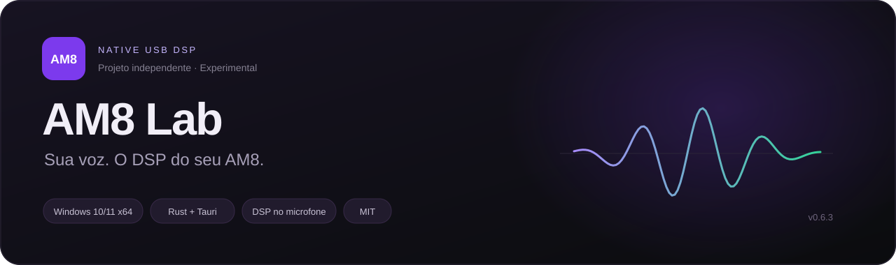
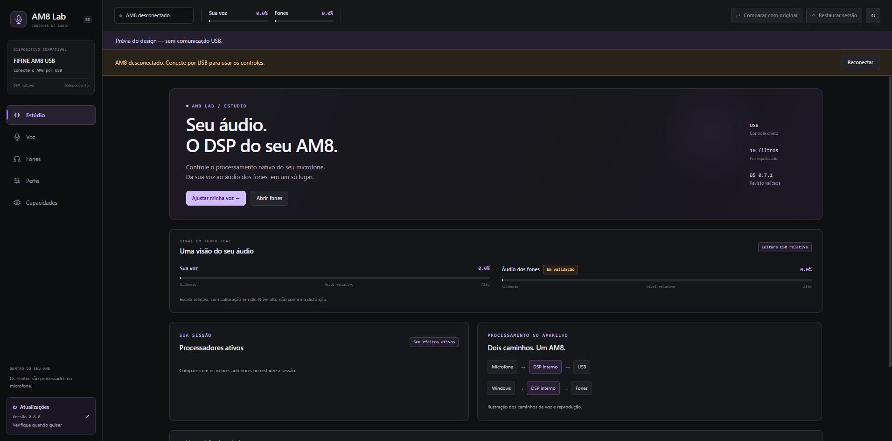

<div align="center">

# AM8 Lab — FIFINE AM8 software for Windows



**Software experimental para ajustar sua voz e os fones no DSP do FIFINE AM8 USB.**


[](LICENSE)

**[Baixar instalador Windows](https://github.com/NightXXT/am8lab/releases/download/v0.6.9/AM8-Lab-Setup-v0.6.9.exe)** · [Versão portátil](https://github.com/NightXXT/am8lab/releases/download/v0.6.9/AM8-Lab-Portable-v0.6.9.zip) · [Hashes SHA-256](https://github.com/NightXXT/am8lab/releases/download/v0.6.9/SHA256SUMS.txt) · [Release 0.6.9](https://github.com/NightXXT/am8lab/releases/tag/v0.6.9)

[Instalação](#instalação) · [Atualizações](#atualizações) · [Recursos](#recursos) · [Compatibilidade](#compatibilidade) · [Segurança](SECURITY.md) · [English](README.en.md)

</div>

---

O **AM8 Lab** é um aplicativo experimental e não oficial que ajusta os efeitos do DSP do **FIFINE AM8 USB**. A interface prepara os controles; o chip do microfone processa a voz e equaliza o áudio reproduzido nos fones.

Construído com **Rust + Tauri**, com interface em português, medidores de áudio e comparação com o som original da sessão.

> [!IMPORTANT]
> Validado inicialmente em **um AM8 normal USB, firmware B5 0.7.1**. Outras revisões podem ser diferentes e são recusadas pelo aplicativo. O projeto não é afiliado nem endossado pela FIFINE.

**Para começar:** baixe o setup, confira o SHA-256, instale e conecte o AM8 por USB. O programa confere a compatibilidade antes de habilitar os ajustes. Os binários ainda não têm assinatura Authenticode; consulte [o guia de instalação](docs/INSTALL.md).



*Prévia da interface com dados simulados. Os medidores do aplicativo conectado usam leituras HID relativas, sem calibração em dB.*

### Aplicar mais rápido na 0.6.9

O botão **Aplicar** continua enviando os ajustes quando você confirma. A comunicação USB consulta as respostas com menos espera e reaproveita leituras de preparação dentro do mesmo comando. Em um AM8 B5 0.7.1, o comando de ruído caiu de **5,22 s para 1,32 s**; o tom padrão, de **5,82 s para 1,33 s**. São medições locais de uma aplicação por ajuste, incluindo verificação do aparelho, confirmação por leitura e atualização completa do estado.

O diário antes das escritas, a verificação de compatibilidade e a restauração foram preservados. Efeitos com mais parâmetros ou espera de processamento continuam levando mais tempo. Consulte [a metodologia, os resultados e os limites](docs/PERFORMANCE.md).

### Ajuste visual na 0.6.8

A ilustração do microfone foi removida do painel Estúdio. As informações de USB, filtros e firmware ocupam o lado direito nas janelas amplas e ficam abaixo do texto nas janelas menores.

## Recursos

| Recurso | O que você pode ajustar |
| :--- | :--- |
| 🎙️ **Redução de ruído** | Limiar, intensidade, ataque e liberação para atenuar sons baixos entre as palavras. |
| 🎚️ **EQ do microfone** | Dez filtros para sua voz: pico, graves/agudos shelf, passa-altas e passa-baixas; curva estimada e compensação de ganho. |
| 🎧 **EQ dos fones** | Equalizador independente para amigos, músicas e jogos reproduzidos pelo AM8; dez filtros, ajustes de −6 a +6 dB e compensação de ganho. |
| 🔊 **Ganho geral dos fones** | 0 a +18 dB no DSP, com botão para voltar a 0 dB; mantém a compensação dos filtros. |
| 📊 **Compressor** | Uma faixa, com limiar, razão, ataque e liberação. |
| 🎵 **Tom da voz** | Algoritmo padrão e Pro; Pro limitado a −3/+3 semitons nesta versão. |
| 🧬 **Transformação Pro** | Controles independentes de altura e timbre. |
| 🪩 **Reverb Sala/Plate** | Disponível como experimental; há relato de estalos na reprodução. |
| 🔉 **Supressão de microfonia** | Experimental; eficácia acústica ainda não medida. |
| ⬇️ **Atualizações** | Consulta manual das Releases do GitHub, com download do setup no navegador padrão. |
| 💾 **Perfis locais** | Salve os controles no computador e carregue quando quiser. |
| ↔️ **Comparar e restaurar** | Alterne entre os efeitos e os valores anteriores à sessão; restaure todos os ajustes afetados. |

**Tom, transformação e reverb funcionam um por vez.** Ruído, EQ do microfone e compressor podem ser combinados. O EQ dos fones tem seus próprios controles.

### Novo na versão 0.6.7 · Um estúdio para o DSP do AM8

Interface redesenhada a partir do material do Google Stitch, com superfícies grafite, acentos violeta, tipografia legível e transições discretas. A navegação reúne **Estúdio**, **Voz**, **Fones**, **Perfis** e **Capacidades**. Os controles continuam ligados aos mesmos comandos Rust e ao processamento nativo do microfone.

Na página **Voz**, cada módulo tem seu botão **Aplicar** e estado próprio. **Fones** abre o EQ de reprodução, independente do EQ da voz. A página **Capacidades** distingue resultados confirmados por escuta, comunicação/restauração e recursos experimentais. Os medidores finos continuam mostrando leituras HID relativas; o novo visual não introduz processamento de áudio no computador.

As fontes, ícones e estilos usados pela interface são locais ou do sistema, sem pedidos de fonte/CDN ao abrir o programa. Consulte [o mapeamento do design e seus limites](docs/REDESIGN.md).

### Atualizações manuais

O botão **Atualizações**, na parte inferior do aplicativo, mostra a versão instalada e permite **Verificar atualizações**. A consulta funciona mesmo sem o AM8 conectado. Se houver um setup mais novo, **Baixar instalador** abre o arquivo da Release no navegador padrão. A instalação continua manual: feche o AM8 Lab normalmente para restaurar a sessão antes de executar o setup baixado.

O destino é [NightXXT/am8lab](https://github.com/NightXXT/am8lab/releases). O aplicativo não procura atualizações ao iniciar, não instala nada automaticamente e não envia áudio ou identidade do microfone. Veja [como funciona a consulta](docs/UPDATES.md).

### Equalizador dos fones e ganho geral

No equalizador, escolha **Voz** para ajustar sua voz ou **Fones** para ajustar o áudio recebido do Windows. Para ouvir o EQ dos fones, o áudio precisa sair pelo dispositivo de reprodução do AM8, com os fones ligados ao P2 dele.

O **Ganho geral dos fones** começa em 0 dB e chega a **+18 dB**, limite do descritor nativo deste AM8. O pedido de +20 dB excede essa faixa e é recusado. Prepare o ganho e clique em **Aplicar EQ dos fones**. Ganho positivo pode distorcer; não há limitador automático. Veja [o funcionamento e os testes do ganho](docs/HEADPHONE-GAIN.md).

O teste físico de um passa-baixas de 2.500 Hz produziu menos agudos audíveis nos fones e foi restaurado após 60 segundos. Os demais filtros usam o mesmo bloco nativo, mas todas as combinações ainda não receberam avaliação auditiva. Consulte [o teste e seus limites](docs/HEADPHONE-EQ.md).

### Uma interface para acompanhar seu áudio

- Barras finas com leituras HID reais de **voz** e **reprodução**.
- Consulta da saída padrão do Windows, sem mudar o roteamento.
- Controles em português, módulos por efeito, tema grafite e transições discretas.
- Detecção automática do AM8 USB compatível.

Os medidores usam uma **escala visual relativa**, sem calibração em dB. A resposta da reprodução foi observada, mas sua sincronização e escala ainda não foram completamente caracterizadas. A curva do EQ é uma estimativa, não uma medição do áudio.

## Instalação

**Requisitos:** Windows 10/11 x64, WebView2 e AM8 USB compatível.

1. Abra a [Release 0.6.9](https://github.com/NightXXT/am8lab/releases/tag/v0.6.9).
2. Baixe o [instalador Windows](https://github.com/NightXXT/am8lab/releases/download/v0.6.9/AM8-Lab-Setup-v0.6.9.exe) e os [hashes SHA-256](https://github.com/NightXXT/am8lab/releases/download/v0.6.9/SHA256SUMS.txt).
3. Confira o hash conforme [o guia de instalação](docs/INSTALL.md) e execute o setup.
4. Conecte o AM8 por **USB** e abra o programa.

O setup instala para o usuário atual, cria atalhos e inclui desinstalador. Se o WebView2 estiver ausente, o bootstrapper oficial da Microsoft precisará de internet para instalar o runtime. A compatibilidade do microfone é conferida ao abrir o aplicativo; ele não precisa estar conectado durante a instalação.

<details>
<summary><strong>Prefere uma versão portátil?</strong></summary>

Baixe `AM8-Lab-Portable-v0.6.9.zip` nas Releases, confira o hash, extraia a pasta e abra `AM8-Lab.exe`. Mantenha os arquivos de licença que acompanham o programa. WebView2 precisa estar instalado.

</details>

> [!NOTE]
> Os executáveis ainda **não têm assinatura digital Authenticode**. O SHA-256 confere integridade em relação à lista da Release; não substitui uma assinatura nem garante confiança no arquivo.

## Atualizações

1. Clique em **Atualizações** no rodapé e depois em **Verificar atualizações**.
2. Quando houver uma versão mais nova, clique em **Baixar instalador**. O navegador abre o setup validado da Release.
3. Confira o hash publicado, feche o aplicativo normalmente e execute o novo setup.

A verificação considera até 30 Releases publicadas e usa a versão do arquivo `AM8-Lab-Setup-vX.Y.Z.exe`. Atualizar somente o código do repositório não cria uma atualização instalável. Se o app local for mais novo que o setup publicado, ele informa isso e não oferece uma versão antiga. As pré-releases experimentais também podem aparecer, identificadas no painel.

## Começando

### 1 · Conecte

Abra o aplicativo com o AM8 ligado por USB. Aguarde **“AM8 conectado e verificado”**. O programa confere a identidade, versão, layout HID e fingerprint do fluxo interno.

### 2 · Prepare e aplique

Ajuste os controles e pressione **Aplicar** no efeito desejado. Mover um slider ou carregar um perfil prepara os valores; isso não envia todos os ajustes automaticamente. Os perfis novos podem guardar os dois equalizadores; um perfil antigo sem EQ dos fones preserva os controles atuais dos fones.

### 3 · Ouça e compare

Use **Comparar com original** para alternar com os valores anteriores à sessão. Essa referência preserva o que já existia antes de abrir os efeitos; não é necessariamente um microfone sem processamento.

### 4 · Restaure quando terminar

Use **Restaurar sessão** ou feche normalmente. O programa restaura os parâmetros e canais afetados antes de sair. Se a comunicação falhar, reconecte e restaure.

### Um ponto de partida para voz natural

Experimente **ruído + EQ suave + compressor leve**, com tom, transformação e reverb desligados. Ouça em volume confortável e ajuste conforme sua voz e ambiente. Não existe um preset ideal para todas as pessoas.

## Compatibilidade

| Item | Configuração |
| :--- | :--- |
| Sistema | Windows 10/11 x64 — sistemas alvo |
| Microfone | FIFINE AM8 normal, conectado por USB |
| Firmware | **B5 0.7.1** |
| Biblioteca / engine | **2.43.2 / 2.23.2** |
| USB | VID:PID **3142:A010**, interface **MI_04** |
| Fluxo | Modo **HunXiang** e fingerprint conhecido |

A identidade do aparelho é verificada antes de permitir alterações. **Não remova essa proteção para aceitar outro firmware sem investigação e testes.** Os testes físicos iniciais cobriram apenas uma unidade/revisão.

<details>
<summary><strong>Detalhes da verificação e recuperação</strong></summary>

O fluxo interno é comparado por comprimento e SHA-256. O pacote público não inclui o grafo bruto, firmware ou DLL extraída do aparelho.

Antes de escrever, o aplicativo salva os valores originais em um diário vinculado ao serial. Ele confirma os ajustes por leitura e tenta restaurar os valores afetados em caso de falha.

Diário local: `%LOCALAPPDATA%/AM8Lab/efeitos-recuperacao.json`.

Não edite, apague ou copie esse arquivo para outro microfone quando houver uma sessão pendente. Recuperações sem serial válido são recusadas e preservadas. Reconecte o mesmo aparelho e use a restauração.

</details>

## Perguntas frequentes

### O FIFINE AM8 tem software?

O **AM8 Lab** oferece controles experimentais para o DSP interno do AM8 USB compatível. É um projeto independente da comunidade; não é software oficial nem uma declaração de suporte da FIFINE. Veja os recursos e as evidências nos documentos deste repositório.

### Funciona com USB ou XLR?

Os comandos do AM8 Lab precisam da conexão **USB**. XLR sozinho não recebe esses comandos. Os efeitos aqui documentados foram ouvidos no caminho USB; não prometemos o mesmo comportamento pela saída XLR.

### Funciona em qualquer AM8?

Ainda não. A validação física cobriu **uma unidade do AM8 normal com firmware B5 0.7.1** e fluxo interno conhecido. O programa bloqueia revisões desconhecidas antes de escrever parâmetros. Não remova essa verificação para forçar uma conexão.

### Como atualizo o programa?

Use **Atualizações → Verificar atualizações → Baixar instalador**. Confira o hash, feche o aplicativo normalmente para restaurar a sessão e execute o novo setup. A instalação é manual; não há atualização de firmware. As [Releases](https://github.com/NightXXT/am8lab/releases) também podem ser acessadas pelo navegador.

### O EQ dos fones muda o áudio dos jogos e do Discord?

Sim, quando esse áudio sai pelo dispositivo de reprodução do AM8 e é ouvido no P2 dele. Outra placa de som ou um fone USB não passa por esse EQ.

### Tem RGB ou afinação automática?

Não. Esses recursos estão fora desta versão. Os efeitos experimentais e seus limites estão identificados na interface e nesta documentação.

## Limitações conhecidas

> [!WARNING]
> **Reverb é experimental.** Foram relatados estalos ao ouvir áudio nos fones; eles pararam ao desativar o reverb. A causa técnica não foi determinada. Para uso natural, mantenha-o desligado.

- Supressão de microfonia ainda não teve eficácia acústica medida.
- XLR sozinho não transporta os comandos USB.
- Não há controle de RGB nem detecção física de fones no conector P2.
- Afinação automática, echo e compressor multibanda estão fora desta versão.
- Nem todos os valores e combinações receberam avaliação auditiva; no EQ dos fones, a confirmação audível inicial cobriu um passa-baixas de 2.500 Hz.
- O EQ dos fones não afeta som que sai por outro dispositivo de reprodução do Windows.
- Ajustes e perfis não são gravados na firmware.

## Segurança e privacidade

A interface permite somente comandos próprios tipados e escuta de eventos. Os valores são validados no Rust; o app não oferece comandos genéricos de shell, rede ou arquivos pela interface. Ele não grava voz, não faz upload de áudio e não inclui telemetria de rede. A consulta manual de atualizações acessa a API pública do GitHub por HTTPS e informa a versão do app no User-Agent.

Na versão 0.6.9, **47 testes Rust passaram**; a medição física de nove aplicações confirmou os valores e sua restauração. A metodologia e os limites estão em [PERFORMANCE.md](docs/PERFORMANCE.md). A auditoria RustSec não foi repetida nesta versão.

Na versão 0.6.7, **42 testes Rust passaram**, incluindo 11 testes novos para selecionar Releases, versões, limites e URLs de atualização, além de 17 verificações da interface de atualizações com transporte simulado. O resumo do teste do executável, instalador e consulta real está em [verificação da consulta](docs/UPDATES.md#verificação). Os testes históricos de efeitos e ganho continuam documentados em seus relatórios, sem nova avaliação auditiva nesta alteração.

A revisão da versão 0.6.3 encontrou zero alertas classificados como vulnerabilidades e dois avisos informativos de dependências fora do alvo Windows. As versões das dependências foram mantidas; essa auditoria não foi repetida para 0.6.7. Foram acrescentados recursos do Windows para HTTPS via WinHTTP e abertura do navegador, com quatro comandos próprios tipados e URLs restritas. A interface não recebe um comando genérico para abrir qualquer endereço.

Isso **não garante ausência de vulnerabilidades**. Consulte a [revisão e seu escopo](docs/SECURITY-REVIEW.md) e a [política de segurança](SECURITY.md). O instalador pode precisar de internet para instalar WebView2.

## Encontrou um problema?

Abra uma **Issue** com:

- versão do aplicativo, Windows e firmware exibida;
- conexão usada e onde você ouviu o áudio;
- efeitos ativos e passos para reproduzir;
- resultado esperado, resultado observado e se restaurar resolveu.

Não envie serial, caminhos pessoais, gravações privadas ou o diário completo. Para falhas de segurança, siga [SECURITY.md](SECURITY.md).

## Ajude a melhorar o AM8 Lab

Se você tem um AM8 compatível, [conte seu resultado em uma Issue](https://github.com/NightXXT/am8lab/issues/new/choose), incluindo versão do app, firmware exibida e quais ajustes usou. Evite enviar serial, diário de recuperação ou áudio privado.

Se o projeto for útil, você pode dar uma estrela e compartilhar o [link do repositório](https://github.com/NightXXT/am8lab). Consulte também a [documentação em inglês](README.en.md).

## Para desenvolvedores

O código foi organizado para separar a interface dos comandos e da comunicação USB:

```text
am8-lab/
├── ui/                    # Interface HTML, CSS e JavaScript
├── src-tauri/
│   ├── src/               # SDK, validação, sessões e integração Windows
│   ├── examples/          # Diagnóstico para desenvolvedores
│   ├── capabilities/      # Permissões da interface
│   └── data/              # Metadados e fixtures dos testes
├── docs/                  # Instalação, compilação e revisão
└── .github/               # CI Windows e atualização de dependências
```

[Compilar no Windows](docs/BUILD.md) · [Contribuir](CONTRIBUTING.md) · [Origem dos dados](docs/PROVENANCE.md) · [Dependências](docs/DEPENDENCIES.json)

O workflow está configurado para verificar testes e dependências e gerar o setup como artefato. Na publicação da 0.6.7, [a execução no GitHub Actions](https://github.com/NightXXT/am8lab/actions/runs/37579658381) não iniciou o runner por um bloqueio de cobrança da conta. Os resultados locais estão em [VERIFICACAO.md](VERIFICACAO.md); não representam uma execução aprovada de CI no GitHub.

---

<div align="center">

**Feito para explorar o AM8, com ajustes temporários e restauráveis.**

[MIT](LICENSE) · [Avisos de terceiros](THIRD-PARTY-NOTICES.md)

FIFINE é marca de seus titulares. Projeto independente, sem afiliação com o fabricante.

</div>
